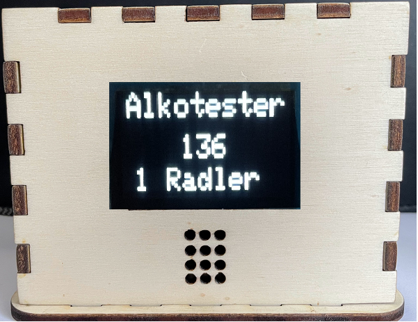
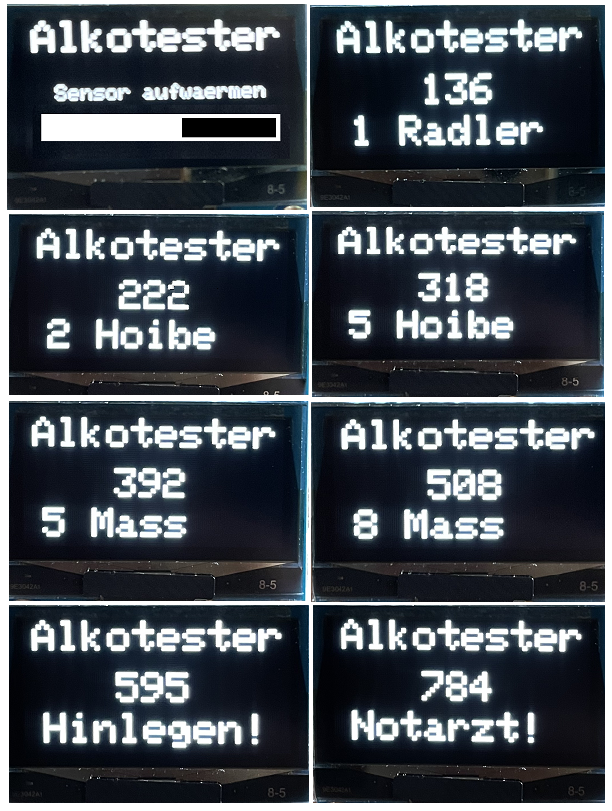
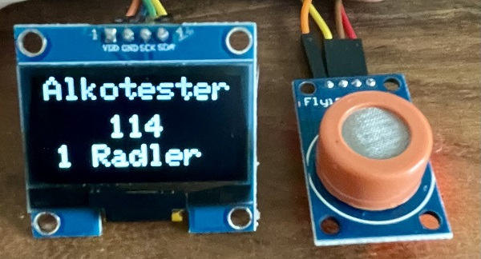

# Alkotester

## Story
Das Repo beschreibt ein Testgerät für das Wohlbefinden im Biergarten. Nach dem Einschalten erscheint eine Balkenanzeige. Sie zeigt die Aufwärmphase des Sensors. 
Die Messung wird in sieben Stufen unterteilt. Bei einem Messwert >200ppm leuchtet die LED "don't drive" und bei einem Meßwert >400ppm empfiehlt sich eine Brotzeit und eine Trinkpause.

---

## Abstufungen beim Alkotest

---

Für die Inbetriebnahme steht ein Testprogramm für den MQ-3 Sensor mit Library und ein Testprogramm für das OLED-Display mit I2C-Scanner zur Verfügung.

## Hardware:
+ 1 NANO
+ 1 MQ-03 Sensor
+ 1 OLED-Display 1,3"
+ 1 Gehäuse
+ Verbrauchsmaterial

## MQ-03 Sensor 
Dieser analoge Gassensor besitzt ein kleines Heizelement mit einem elektronisch-chemischen Sensor. Er ist für die Verwendung in Gebäuden geeignet. Er kann erst nach Beendigung der Aufwärmphase genaue Messwerte ausgeben.
Achtung: Der Sensor wird bei Betrieb warm!

Technische Daten:
+	Messbereich: 100 - 1000 ppm
+	Messbare Substanzen: Ethanol, Alkohol über die Wasserstoffkonzentration
+	Einsatzbereiche: z.B. für Atemalkoholtester, für Robotik, Mikrocontrollerprojekte
+	Kompatibel mit: Raspberry Pi (mit AD-Wandler), Arduino, etc.
+	Besonderheiten: hohe Empfindlichkeit, welche mit einem Potentiometer angepasst werden kann, schnelle Reaktionszeit, kaum Sensitivität zu Benzin
+	Analoge Ausgabe: Auswertung der Messwerte vom Mikrocontroller
+	Digitale Ausgabe: Schwellenwerteinstellung möglich
+	Pins: VCC: Stromversorgung 5V, GND Masse, AOUT: Analoger Output, DOUT: Digitaler Output
+	Antwortzeit: ≤ 1 s
+	Ansprechzeit nach dem Einschalten: ≤ 30 s
+	Heizstromaufnahme: ≤ 150 mA
+	Heizstromspannung: 5 ±0,2 V / 1,5 ±0,1 V
+	Heizenergieleistung: 750 mW
+	Abmessungen: 32 x 21 x 20 mm

---

## Verdrahtung OLED-Display:

| NANO  |   Display  |  MQ-03    |
| -------- | -------- | -------- |
| GND     |   GND    |   GND     | 
| 5V     |   VCC    |    VCC    |
|  A0    |  NC     |   A0    |
| A4  |   SDA  |    NC   |
|  A5   |    SCL  |   NC    |
| -------- | -------- | -------- |

## Versuchsaufbau

---

   
<ol class="breadcrumb" style="border-top: 2px solid black;border-bottom:2px solid black; height: 45px; width: 900px;"> 
<a href="#oben">nach oben</a>
</ol>

  
